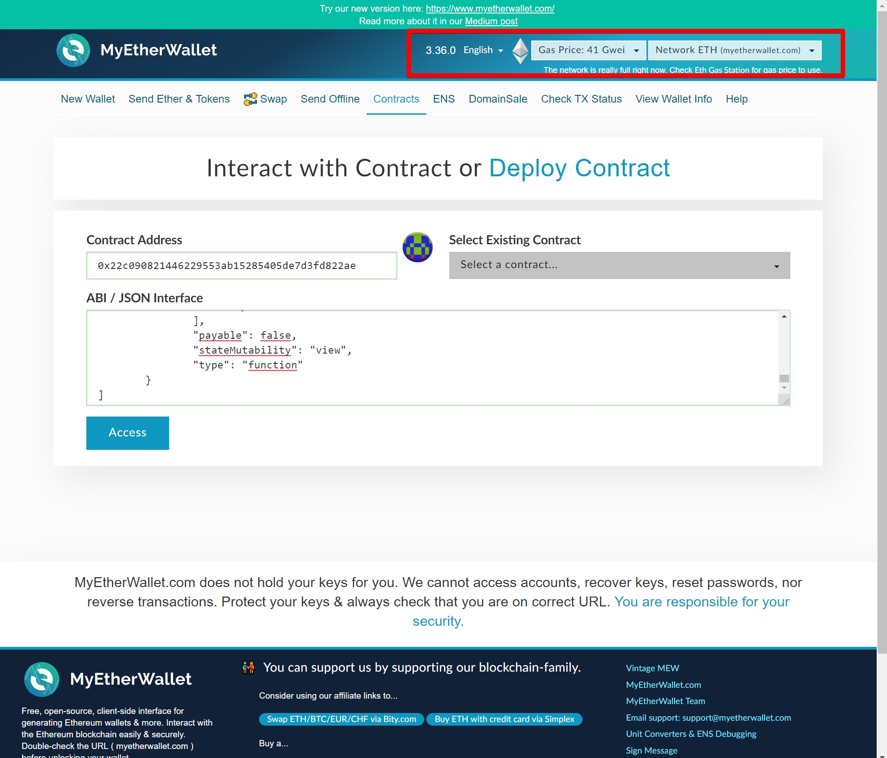
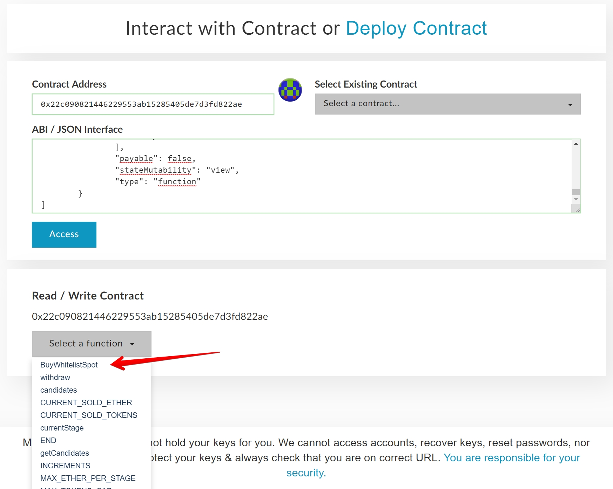
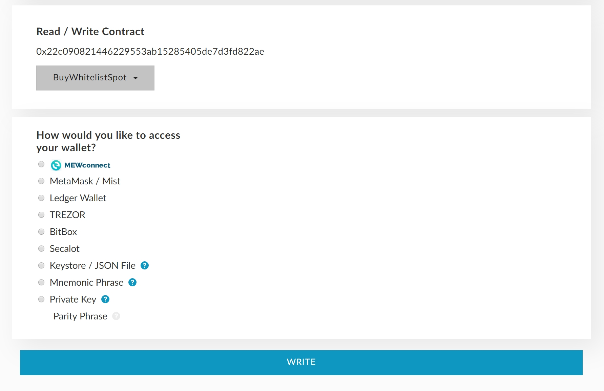
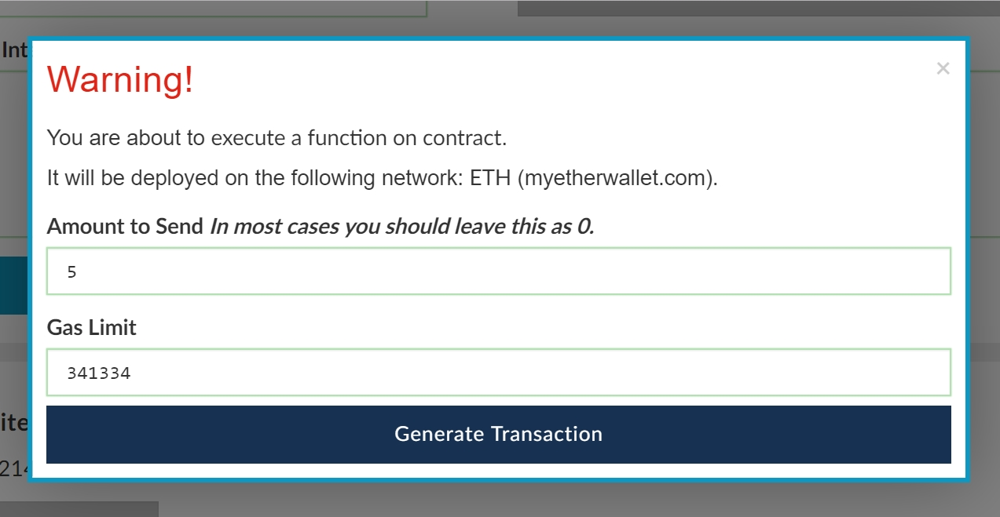

# Caelum - Raising Funds for Mainnet Development & Marketing

### Reasoning

As I am sure the majority of you are aware, Caelum Project has been mostly funded by the developer and donations from the community. With a working testnet deployed and running, it is now time for us to think about the next stage. The monthly running costs of the testnet are reasonably large, and we would really like to grow awareness about Caelum in the run up to the official fundraising sale, with a targeted price of 1 CLMP for 20 cents.

In order to achieve this, we are going to offer a fraction of the tokens currently set aside to existing Caelum Community members for a reduced price to ensure we are able to promote the sale and launch properly. This sale will not be widely publicised, only within the existing Caelum community. There will be six stages, and with each 50k sold, the price goes up by ~1 cent. The structure will be as follows:

| Number of CLMP | Price in Ethereum | Price in USD |
|--|--|--|
| 50.000 | 0.00030 | ~$0.05 |
| 50.000 | 0.00035 | ~$0.06 |
| 50.000 | 0.00040 | ~$0.07 |
| 50.000 | 0.00045 | ~$0.08 |
| 50.000 | 0.00050 | ~$0.09 |
| 50.000 | 0.00055 | ~$0.10 |

**There will be 300,000 CLMP available through this fundraiser*

### How it will work

Below you will find instructions on how and where you can send funds and in return you will be automatically included in our genesis account whitelist. In case you were not aware, your existing Ethereum address and private key will become your Caelum address and private key, thus it is very important that the funds you send are from your own wallet, and not an exchange wallet for example.

If there is the equivalent of 1 ETH left for sale at ~5 cent, and you send 2 ETH, you will be sent 1 ETH worth of CLMP priced at ~5 cents and 1 ETH work of CLMP priced at ~6 cents. It will run on a “first come, first served”, and when they are gone, they are gone.

### Thank you for your continued support

Any funds raised from this will help enable the project to grow properly, but will also allow you all the chance to secure enough CLMP, at a reduced price, to be able to run a Masternode at mainnet launch.

## DevSale details

**Start:**  Wednesday 17 April 2019 18:00:00 GMT
**Duration:** 30 days

**Q: What happens with the non sold amount?**
**A:** Every CLMP that get's whitelisted is included in the genesis file on our mainnet launch. There are no tokens or coins in existence yet, so the unsold amount will never be created. The sold amount will be deducted from the developer wallet.

**Q: Why a sale???**
**A:** See https://medium.com/@caelumproject/caelum-update-notice-4bffbb7389d7

## Participation using MyEtherWallet

### Step 1:

Go to https://vintage.myetherwallet.com or https://www.myetherwallet.com
Make sure to select the **ETH** network in the upperright corner of the page. On the central page, select the **contracts** tabpage.

In the **Contract Address** field, paste the contract address :

**0x22c090821446229553ab15285405de7d3fd822ae**

In the **ABI/JSON Interface** box, paste everything below:

    [
    	{
    		"constant": false,
    		"inputs": [],
    		"name": "BuyWhitelistSpot",
    		"outputs": [
    			{
    				"name": "success",
    				"type": "bool"
    			}
    		],
    		"payable": true,
    		"stateMutability": "payable",
    		"type": "function"
    	},
    	{
    		"constant": false,
    		"inputs": [],
    		"name": "withdraw",
    		"outputs": [],
    		"payable": false,
    		"stateMutability": "nonpayable",
    		"type": "function"
    	},
    	{
    		"inputs": [],
    		"payable": false,
    		"stateMutability": "nonpayable",
    		"type": "constructor"
    	},
    	{
    		"constant": true,
    		"inputs": [
    			{
    				"name": "",
    				"type": "uint256"
    			}
    		],
    		"name": "candidates",
    		"outputs": [
    			{
    				"name": "",
    				"type": "address"
    			}
    		],
    		"payable": false,
    		"stateMutability": "view",
    		"type": "function"
    	},
    	{
    		"constant": true,
    		"inputs": [],
    		"name": "CURRENT_SOLD_ETHER",
    		"outputs": [
    			{
    				"name": "",
    				"type": "uint256"
    			}
    		],
    		"payable": false,
    		"stateMutability": "view",
    		"type": "function"
    	},
    	{
    		"constant": true,
    		"inputs": [],
    		"name": "CURRENT_SOLD_TOKENS",
    		"outputs": [
    			{
    				"name": "",
    				"type": "uint256"
    			}
    		],
    		"payable": false,
    		"stateMutability": "view",
    		"type": "function"
    	},
    	{
    		"constant": true,
    		"inputs": [],
    		"name": "currentStage",
    		"outputs": [
    			{
    				"name": "",
    				"type": "uint256"
    			}
    		],
    		"payable": false,
    		"stateMutability": "view",
    		"type": "function"
    	},
    	{
    		"constant": true,
    		"inputs": [],
    		"name": "END",
    		"outputs": [
    			{
    				"name": "",
    				"type": "uint256"
    			}
    		],
    		"payable": false,
    		"stateMutability": "view",
    		"type": "function"
    	},
    	{
    		"constant": true,
    		"inputs": [],
    		"name": "getCandidates",
    		"outputs": [
    			{
    				"name": "",
    				"type": "address[]"
    			}
    		],
    		"payable": false,
    		"stateMutability": "view",
    		"type": "function"
    	},
    	{
    		"constant": true,
    		"inputs": [],
    		"name": "INCREMENTS",
    		"outputs": [
    			{
    				"name": "",
    				"type": "uint256"
    			}
    		],
    		"payable": false,
    		"stateMutability": "view",
    		"type": "function"
    	},
    	{
    		"constant": true,
    		"inputs": [],
    		"name": "MAX_ETHER_PER_STAGE",
    		"outputs": [
    			{
    				"name": "",
    				"type": "uint256"
    			}
    		],
    		"payable": false,
    		"stateMutability": "view",
    		"type": "function"
    	},
    	{
    		"constant": true,
    		"inputs": [],
    		"name": "MAX_TOKENS_CAP",
    		"outputs": [
    			{
    				"name": "",
    				"type": "uint256"
    			}
    		],
    		"payable": false,
    		"stateMutability": "view",
    		"type": "function"
    	},
    	{
    		"constant": true,
    		"inputs": [],
    		"name": "MAX_TOKENS_PER_STAGE",
    		"outputs": [
    			{
    				"name": "",
    				"type": "uint256"
    			}
    		],
    		"payable": false,
    		"stateMutability": "view",
    		"type": "function"
    	},
    	{
    		"constant": true,
    		"inputs": [],
    		"name": "MIN_PURCHASE",
    		"outputs": [
    			{
    				"name": "",
    				"type": "uint256"
    			}
    		],
    		"payable": false,
    		"stateMutability": "view",
    		"type": "function"
    	},
    	{
    		"constant": true,
    		"inputs": [],
    		"name": "owner",
    		"outputs": [
    			{
    				"name": "",
    				"type": "address"
    			}
    		],
    		"payable": false,
    		"stateMutability": "view",
    		"type": "function"
    	},
    	{
    		"constant": true,
    		"inputs": [],
    		"name": "PRICE_PER_TOKEN",
    		"outputs": [
    			{
    				"name": "",
    				"type": "uint256"
    			}
    		],
    		"payable": false,
    		"stateMutability": "view",
    		"type": "function"
    	},
    	{
    		"constant": true,
    		"inputs": [],
    		"name": "REMAINING_TOKENS_FOR_STAGE",
    		"outputs": [
    			{
    				"name": "",
    				"type": "uint256"
    			}
    		],
    		"payable": false,
    		"stateMutability": "view",
    		"type": "function"
    	},
    	{
    		"constant": true,
    		"inputs": [],
    		"name": "remainingTokens",
    		"outputs": [
    			{
    				"name": "",
    				"type": "uint256"
    			}
    		],
    		"payable": false,
    		"stateMutability": "view",
    		"type": "function"
    	},
    	{
    		"constant": true,
    		"inputs": [],
    		"name": "START",
    		"outputs": [
    			{
    				"name": "",
    				"type": "uint256"
    			}
    		],
    		"payable": false,
    		"stateMutability": "view",
    		"type": "function"
    	},
    	{
    		"constant": true,
    		"inputs": [
    			{
    				"name": "",
    				"type": "address"
    			}
    		],
    		"name": "whiteListed",
    		"outputs": [
    			{
    				"name": "owner",
    				"type": "address"
    			},
    			{
    				"name": "cap",
    				"type": "uint256"
    			},
    			{
    				"name": "CLMP",
    				"type": "uint256"
    			}
    		],
    		"payable": false,
    		"stateMutability": "view",
    		"type": "function"
    	}
    ]

Click the **Access** button to open the smart contract and interact with it.

### Step 2:

From the dropdownbox under **Read / Write Contract**, select **BuyWhitelistSpot**.

### Step 3:

After selecting the correct function, a new box will appear the allows you to unlock your wallet of choice. Proceed with the steps needed to unlock your wallet and click **WRITE** to continue

### Step 4:

You must add the value you wish to spend in the **Amount to Send** field. This is the amount in Ethereum that you want to use against a whitelist spot on the Caelum launch. The Gas Limit will adapt accordingly. Select **Generate Transaction** and confirm the transaction.

Once the transaction has been confirmed, you're account is whitelisted with the corresponding value in CLMP.

## Verify your amount of CLMP.

In the same contract, select the option **WhiteListed** and enter your address. You will receive the amount of CLMP given.
